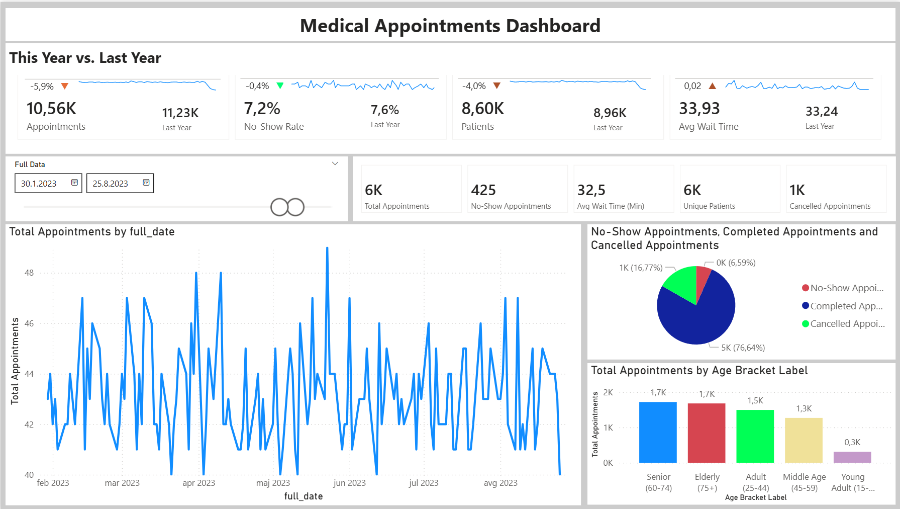
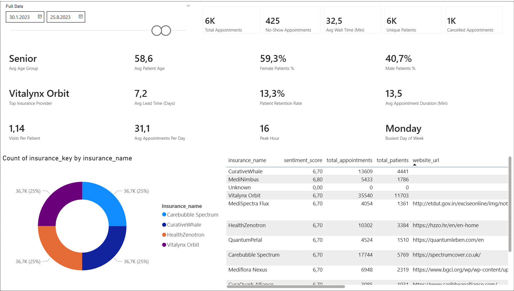
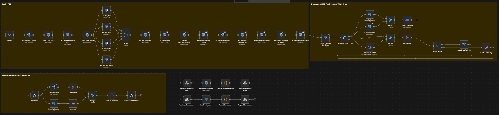

# Medical Appointments BI Solution

A full-stack Business Intelligence system for healthcare appointment analytics, built with an AI-assisted development workflow using Claude Code.

## Dataset License and Attribution

`data/` directory contains a dataset obtained from Kaggle and is licensed under the
**Creative Commons Attribution 4.0 International (CC BY 4.0)** license.

### Dataset Information

- **Title:** Medical Appointment Scheduling System
- **Author:** María Carolina Gonzalez Galtier
- **Source:** Kaggle  
  <https://www.kaggle.com/datasets/carogonzalezgaltier/medical-appointment-scheduling-system>
- **License:** CC BY 4.0  
  <https://creativecommons.org/licenses/by/4.0/>

### Usage in This Project

- The dataset is used **for university research purposes only**
- The data has **not been modified**
- The data is **not being commercialized** as part of this project

### Attribution

© María Carolina Gonzalez Galtier  
Used under the terms of the Creative Commons Attribution 4.0 International License.

No endorsement by the original author is implied.

### Disclaimer

No warranties are given. Other rights such as privacy, publicity, or moral rights
may apply.

## Power BI Modeling MCP Server

This project includes a locally bundled installation of the **Power BI Modeling MCP Server**
for convenience and reproducibility.

- **Source repository:**  
  <https://github.com/microsoft/powerbi-modeling-mcp>
- **License:** MIT License
- **Author:** Microsoft

### Installation Method

The MCP server is not distributed as a standalone binary in the source repository.
Instead, it was installed by:

1. Downloading the official VSIX package from the Visual Studio Marketplace
2. Extracting the server executable as documented by Microsoft
3. Placing the unmodified server files inside this repository

No modifications have been made to the MCP server binaries or source files.

### Purpose

The MCP server is included to:

- Simplify setup for reviewers and collaborators
- Ensure consistent Power BI modeling behavior
- Avoid environment-specific installation steps

This project does **not** claim ownership of the MCP server.
No endorsement by Microsoft is implied.

## Table of Contents

- [Overview](#overview)
- [Key Metrics & KPIs](#key-metrics--kpis)
- [Architecture](#architecture)
- [Tech Stack](#tech-stack)
- [AI-Assisted Development](#ai-assisted-development)
- [Setup & Installation](#setup--installation)
- [ETL Pipeline](#etl-pipeline)
- [Data Warehouse Schema](#data-warehouse-schema)
- [Discord Bot](#discord-bot)
- [Usage](#usage)
- [Development](#development)

---

## Overview

This project provides comprehensive analytics for medical appointment scheduling operations. The solution implements a complete data pipeline from raw CSV ingestion through a staging layer to a star schema data warehouse, enabling healthcare organizations to optimize scheduling efficiency, reduce operational costs, and improve patient experience.

**Business Value:**

- Reduce revenue loss from no-shows and cancellations
- Optimize clinic capacity and resource allocation
- Improve patient satisfaction through reduced wait times
- Identify operational bottlenecks and inefficiencies
- Support data-driven scheduling policy decisions

---

## Key Metrics & KPIs




### Operational Efficiency

| KPI | Description | Formula |
|-----|-------------|---------|
| **Slot Utilization Rate** | % of available slots that result in completed appointments | `completed / total_slots × 100` |
| **Patient Throughput** | Appointments completed per day/hour | `COUNT(completed) GROUP BY date/hour` |
| **Average Appointment Duration** | Mean time spent per appointment | `AVG(appointment_duration_min)` |
| **On-Time Start Rate** | % of appointments starting within 5 min of scheduled time | `on_time_starts / total × 100` |
| **Overbooking Efficiency** | Optimal overbooking rate to maximize utilization | Model based on no-show patterns |

### Patient Experience

| KPI | Description | Formula |
|-----|-------------|---------|
| **Average Wait Time** | Time between check-in and appointment start | `AVG(waiting_time_min)` |
| **Wait Time > 15 min Rate** | % of patients waiting excessively | `long_waits / total × 100` |
| **Early Arrival Rate** | % of patients arriving before scheduled time | `arrived_early / total × 100` |
| **Late Arrival Rate** | % of patients arriving after scheduled time | `arrived_late / total × 100` |

### Scheduling Performance

| KPI | Description | Formula |
|-----|-------------|---------|
| **No-Show Rate** | % of scheduled appointments where patient didn't appear | `no_shows / scheduled × 100` |
| **Cancellation Rate** | % of appointments cancelled | `cancelled / total × 100` |
| **Same-Day Booking Rate** | % of appointments booked on appointment day | `same_day / total × 100` |
| **Average Lead Time** | Mean days between scheduling and appointment | `AVG(scheduling_lead_days)` |
| **Rebooking Rate** | % of cancelled slots that get rebooked | `rebooked / cancelled × 100` |

### Demographic Analysis

| KPI | Description | Business Use |
|-----|-------------|--------------|
| **No-Show by Age Group** | No-show rate segmented by age bracket | Target reminder campaigns |
| **No-Show by Insurance** | No-show rate by insurance provider | Identify high-risk payers |
| **Attendance by Gender** | Completion rate by patient gender | Understand patient behavior |
| **Visit Frequency** | Average visits per patient per year | Patient engagement tracking |

### Time-Based Patterns

| KPI | Description | Business Use |
|-----|-------------|--------------|
| **Peak Hours** | Hours with highest appointment volume | Staff scheduling |
| **Day-of-Week Trends** | Attendance/no-show patterns by weekday | Optimize weekly schedules |
| **Seasonal Patterns** | Monthly/quarterly volume trends | Capacity planning |
| **Morning vs Afternoon** | Performance comparison by day period | Slot allocation strategy |

---

## Architecture

```
┌──────────────────────────────────────────────────────────────────────────────┐
│                              DATA SOURCES                                     │
│    ┌─────────────┐  ┌─────────────┐  ┌─────────────┐                         │
│    │ patients.csv│  │  slots.csv  │  │appointments │                         │
│    └──────┬──────┘  └──────┬──────┘  └──────┬──────┘                         │
└───────────┼────────────────┼────────────────┼────────────────────────────────┘
            │                │                │
            ▼                ▼                ▼
┌──────────────────────────────────────────────────────────────────────────────┐
│                         STAGING (stg_medical_dwh)                            │
│    ┌─────────────┐  ┌─────────────┐  ┌─────────────┐                         │
│    │stg_patients │  │ stg_slots   │  │stg_appoint- │                         │
│    │             │  │             │  │   ments     │                         │
│    └─────────────┘  └─────────────┘  └─────────────┘                         │
└───────────────────────────────┬──────────────────────────────────────────────┘
                                │
                          n8n ETL
                                │
                                ▼
┌──────────────────────────────────────────────────────────────────────────────┐
│                      DATA WAREHOUSE (medical_dwh)                            │
│                                                                              │
│   DIMENSIONS                              FACT                               │
│   ┌───────────┐ ┌───────────┐            ┌────────────────────┐             │
│   │ dim_date  │ │ dim_time  │            │  fact_appointment  │             │
│   └───────────┘ └───────────┘            │                    │             │
│   ┌───────────┐ ┌───────────┐            │  • appointment_id  │             │
│   │dim_status │ │dim_age_   │◄───────────│  • date keys (FK)  │             │
│   │           │ │  group    │            │  • time keys (FK)  │             │
│   └───────────┘ └───────────┘            │  • patient_key(FK) │             │
│   ┌───────────┐ ┌───────────┐            │  • status_key (FK) │             │
│   │dim_insur- │ │dim_patient│◄───────────│  • measures        │             │
│   │   ance    │◄┤           │            └────────────────────┘             │
│   └───────────┘ └───────────┘                                               │
└───────────────────────────────┬──────────────────────────────────────────────┘
                                │
                                ▼
┌──────────────────────────────────────────────────────────────────────────────┐
│                           VISUALIZATION                                       │
│                         ┌─────────────┐                                       │
│                         │  Power BI   │                                       │
│                         └─────────────┘                                       │
└──────────────────────────────────────────────────────────────────────────────┘
```

---

## Tech Stack

| Component | Technology | Purpose |
|-----------|------------|---------|
| **Orchestration** | Docker Compose | Container management |
| **ETL** | n8n | Workflow automation, data transformation |
| **Database** | PostgreSQL | Staging + DWH storage |
| **DB Admin** | Adminer | Web-based DB management |
| **Search/AI** | SearxNG | Meta search for insurance data enrichment |
| **Visualization** | Power BI | Dashboards and reporting |
| **Chat Interface** | Discord.js | Bot for webhook interactions |
| **Tunneling** | ngrok | Expose local webhooks to Discord |
| **Development** | Claude Code | AI-assisted development |

---

## AI-Assisted Development

This project was built using **Claude Code** with an agentic AI workflow, demonstrating how AI can accelerate BI solution development.

### Claude Code Integration

The project uses Claude Code's capabilities for:

- **Schema Design**: Star schema modeling with proper dimension/fact relationships
- **ETL Development**: n8n workflow JSON generation with SQL transformations
- **Code Generation**: Docker configurations, SQL DDL/DML scripts
- **Documentation**: Auto-generated CLAUDE.md for project context

### MCP (Model Context Protocol) Servers

Claude Code can connect to external tools via MCP:

```bash
# Add PostgreSQL MCP for direct DB queries
claude mcp add postgres npx @anthropic/mcp-postgres

# Add Context7 for documentation lookup
claude mcp add context7 npx @anthropic/mcp-context7
```

### Skills & Plugins

Available Claude Code skills used in this project:

- `/commit` - Git commit with conventional messages
- `/init` - Generate CLAUDE.md project context
- `document-skills:xlsx` - Spreadsheet analysis
- `feature-dev:code-architect` - Architecture design

### CLAUDE.md

The `CLAUDE.md` file provides context to Claude Code instances:

```markdown
# Key sections:
- Project Overview
- Architecture diagram
- Docker services
- Common commands
- Service connections
```

---

## Setup & Installation

### Prerequisites

- **Docker Desktop** (with Docker Compose)
- **Node.js** v18+ and npm
- **Git**
- **Power BI Desktop** (for visualization)

### Quick Start (Automated)

The project includes setup scripts for automated installation:

**Windows (PowerShell):**

```powershell
# Full setup
.\setup.ps1 setup

# After setup, run the ETL
.\setup.ps1 etl-run

# Deploy Discord commands and start bot
.\setup.ps1 bot-deploy
.\setup.ps1 bot-start
```

**Linux/macOS (Bash):**

```bash
# Make executable
chmod +x setup.sh

# Full setup
./setup.sh setup

# After setup, run the ETL
./setup.sh etl-run

# Deploy Discord commands and start bot
./setup.sh bot-deploy
./setup.sh bot-start
```

### Setup Script Commands

| Command | Description |
|---------|-------------|
| `setup` | Full initial setup (Docker, databases, n8n workflow, Discord bot deps) |
| `start` | Start Docker services only |
| `stop` | Stop Docker services |
| `reset` | Reset databases (destructive - deletes all data) |
| `cleanup` | Full cleanup - removes containers, volumes, node_modules |
| `etl-run` | Execute the ETL workflow via n8n API |
| `bot-deploy` | Register Discord slash commands |
| `bot-start` | Start the Discord bot (foreground) |
| `help` | Show help message |

---

### Manual Setup

If you prefer manual setup or the script encounters issues:

#### 1. Clone the Repository

```bash
git clone --recurse-submodules https://github.com/your-username/bi_project.git
cd bi_project
```

#### 2. Configure Environment

```bash
# Copy example env file
cp .env.example .env

# Edit with your credentials
# Windows: notepad .env
# Linux/Mac: nano .env
```

**Environment Variables:**

| Variable | Default | Description |
|----------|---------|-------------|
| `POSTGRES_USER` | postgres | Database user |
| `POSTGRES_PASSWORD` | bi_projekat | Database password |
| `POSTGRES_HOST` | db | Database host (Docker service name) |
| `POSTGRES_PORT` | 5432 | Database port |
| `N8N_BASIC_AUTH_USER` | username | n8n login user |
| `N8N_BASIC_AUTH_PASSWORD` | password | n8n login password |
| `NGROK_AUTHTOKEN` | - | ngrok authentication token |
| `NGROK_DOMAIN` | - | ngrok domain/subdomain |
| `N8N_WEBHOOK_URL` | - | Full n8n webhook URL |
| `DISCORD_TOKEN` | - | Discord bot token |
| `DISCORD_CLIENT_ID` | - | Discord application ID |
| `DISCORD_GUILD_ID` | - | Discord server ID |

#### 3. Start Docker Services

```bash
# Start main stack
docker compose up -d

# Verify services are running
docker compose ps
```

**Services:**

| Service | URL | Credentials |
|---------|-----|-------------|
| n8n | <http://localhost:5678> | from .env |
| Adminer | <http://localhost:8765> | postgres / (from .env) |
| PostgreSQL | localhost:5432 | postgres / (from .env) |

#### 4. Create Databases

```bash
docker compose exec db psql -U postgres -c "CREATE DATABASE stg_medical_dwh;"
docker compose exec db psql -U postgres -c "CREATE DATABASE medical_dwh;"
```

#### 5. Import n8n Workflow

1. Open n8n at <http://localhost:5678>
2. Login with credentials from `.env`
3. Go to **Workflows** → **Import from File**
4. Import `n8n/workflows/ETL.json` (consolidated ETL + Webhooks)

#### 6. Configure n8n PostgreSQL Credentials

In n8n, create a PostgreSQL credential:

- **Host:** `db`
- **Database:** `medical_dwh`
- **User:** `postgres`
- **Password:** (from .env)
- **Port:** `5432`

#### 7. Run ETL

1. Open the imported workflow in n8n
2. Click **Execute Workflow**
3. Verify row counts in the final node output

Expected counts (approximate):

```
dim_date: ~4,383
dim_time: 96
dim_status: 3
dim_age_group: 16
dim_insurance: 5 (with enriched analytics)
dim_patient: ~1,000
fact_appointment: ~111,488
agg_daily: ~3,653
agg_monthly: ~120
agg_yearly: ~10
```

#### 8. Setup Discord Bot

```bash
cd discord-bot
npm install
node deploy-commands.js  # Register slash commands
node index.js            # Start bot
```

#### 9. (Optional) Start ngrok for Webhooks

```bash
ngrok http 5678 --authtoken $NGROK_AUTHTOKEN --domain $NGROK_DOMAIN
```

Update `N8N_WEBHOOK_URL` in `.env` with the ngrok URL.

---

## ETL Pipeline



The n8n workflow implements a staged ETL process:

### Pipeline Flow

```
┌─────────────────────────────────────────────────────────────────────────────┐
│  STAGE 1: Staging Load                                                      │
│  ┌──────────────────┐    ┌──────────────────┐                              │
│  │ 1. Create STG    │───▶│ 2. COPY CSVs     │                              │
│  │    Tables        │    │    to Staging    │                              │
│  └──────────────────┘    └────────┬─────────┘                              │
└───────────────────────────────────┼─────────────────────────────────────────┘
                                    ▼
┌─────────────────────────────────────────────────────────────────────────────┐
│  STAGE 2: DWH Schema                                                        │
│  ┌──────────────────┐                                                       │
│  │ 3. Create DWH    │                                                       │
│  │    Schema        │                                                       │
│  └────────┬─────────┘                                                       │
│           │                                                                 │
│           ▼  (parallel)                                                     │
│  ┌────────┴────────┬────────────────┬────────────────┐                     │
│  │ 4a. dim_date    │ 4b. dim_time   │ 4c. dim_status │ 4d. dim_age_group   │
│  │ (generate)      │ (generate)     │ (static)       │ (static)            │
│  └────────┬────────┴────────┬───────┴────────┬───────┴────────┬────────────┘
└───────────┼─────────────────┼────────────────┼────────────────┼─────────────┘
            └─────────────────┴───────┬────────┴────────────────┘
                                      ▼
┌─────────────────────────────────────────────────────────────────────────────┐
│  STAGE 3: Dimension Load (from Staging)                                     │
│  ┌──────────────────┐    ┌──────────────────┐                              │
│  │ 5a. Read STG     │───▶│ 5b. Insert       │                              │
│  │     Insurance    │    │     dim_insurance│                              │
│  └──────────────────┘    └────────┬─────────┘                              │
│                                   ▼                                         │
│  ┌──────────────────┐    ┌──────────────────┐    ┌──────────────────┐      │
│  │ 6a. Read STG     │───▶│ 6b. Transform    │───▶│ 6c. Insert       │      │
│  │     Patients     │    │     (age calc)   │    │     dim_patient  │      │
│  └──────────────────┘    └──────────────────┘    └────────┬─────────┘      │
└───────────────────────────────────────────────────────────┼─────────────────┘
                                                            ▼
┌─────────────────────────────────────────────────────────────────────────────┐
│  STAGE 4: Fact Load                                                         │
│  ┌──────────────────┐    ┌──────────────────┐    ┌──────────────────┐      │
│  │ 7a. Read STG     │───▶│ 7b. Transform    │───▶│ 7c. Insert       │      │
│  │     Appointments │    │   (keys, flags)  │    │  fact_appointment│      │
│  └──────────────────┘    └──────────────────┘    └────────┬─────────┘      │
│                                                           ▼                 │
│                                                  ┌──────────────────┐       │
│                                                  │ 8. Verify Counts │       │
│                                                  └──────────────────┘       │
└─────────────────────────────────────────────────────────────────────────────┘
```

### Transformations

| Stage | Transformation | Description |
|-------|---------------|-------------|
| 4a | `generate_series` | Create date dimension (2014-2025) |
| 4b | `generate_series` | Create time dimension (15-min intervals) |
| 6b | Age calculation | `current_age` from DOB |
| 7b | Key derivation | Date keys (YYYYMMDD), Time keys (HHMM) |
| 7b | Flag derivation | `is_same_day_booking`, `arrived_early`, `arrived_late` |
| 7c | FK lookups | Subqueries to resolve surrogate keys |
| 8a-c | Aggregates | Populate agg_daily, agg_monthly, agg_yearly |
| 8d | Insurance Analytics | Calculate rankings, sentiment scores |
| 9 | Enrichment | Query SearXNG for insurance website URLs |

---

## Data Warehouse Schema

### Star Schema Design

The DWH follows Kimball dimensional modeling principles with a **fine-grain** fact table (one row per appointment).

### Dimensions

#### dim_date

Role-playing dimension for `appointment_date` and `scheduling_date`.

| Column | Type | Description |
|--------|------|-------------|
| date_key | INT | PK (YYYYMMDD) |
| full_date | DATE | Actual date |
| day_of_week | SMALLINT | 1=Mon, 7=Sun |
| day_name | VARCHAR | Monday, Tuesday... |
| month_num | SMALLINT | 1-12 |
| month_name | VARCHAR | January, February... |
| quarter | SMALLINT | 1-4 |
| year | SMALLINT | 2014-2025 |
| is_weekend | BOOLEAN | Sat/Sun flag |

#### dim_time

15-minute granularity for all time fields.

| Column | Type | Description |
|--------|------|-------------|
| time_key | INT | PK (HHMM) |
| full_time | TIME | Actual time |
| hour_24 | SMALLINT | 0-23 |
| hour_12 | SMALLINT | 1-12 |
| period | VARCHAR | AM/PM |
| day_period | VARCHAR | Morning/Afternoon/Evening |
| is_business_hour | BOOLEAN | 8am-5pm flag |

#### dim_status

Appointment status with categorization.

| Column | Type | Description |
|--------|------|-------------|
| status_key | SERIAL | PK |
| status_code | VARCHAR | available, scheduled, completed, cancelled, no-show, did not attend |
| status_category | VARCHAR | pending, attended, missed |
| is_completed | BOOLEAN | Appointment finished |
| is_no_show | BOOLEAN | Patient didn't show |

#### dim_age_group

Patient age brackets (5-year intervals).

| Column | Type | Description |
|--------|------|-------------|
| age_group_key | SERIAL | PK |
| age_group_code | VARCHAR | 15-19, 20-24, ... 90+ |
| age_bracket | VARCHAR | Young Adult, Adult, Middle Age, Senior, Elderly |
| sort_order | SMALLINT | For ordering |

#### dim_insurance

Insurance providers with enriched analytics data.

| Column | Type | Description |
|--------|------|-------------|
| insurance_key | SERIAL | PK |
| insurance_name | VARCHAR | Provider name |
| website_url | VARCHAR | Official website (via SearXNG) |
| company_description | TEXT | Company description |
| headquarters_location | VARCHAR | HQ location |
| phone_number | VARCHAR | Contact number |
| founded_year | SMALLINT | Year founded |
| logo_url | VARCHAR | Company logo URL |
| total_patients | INT | Patient count using this insurer |
| total_appointments | INT | Total appointments for this insurer |
| usage_rank | SMALLINT | Rank by appointment volume |
| completion_rate | NUMERIC | Appointment completion rate |
| no_show_rate | NUMERIC | No-show rate |
| cancellation_rate | NUMERIC | Cancellation rate |
| avg_wait_time_min | NUMERIC | Average patient wait time |
| sentiment_score | NUMERIC | Calculated sentiment (0-10) |
| sentiment_label | VARCHAR | Excellent/Good/Average/Poor |
| last_enriched_at | TIMESTAMP | Last enrichment timestamp |

#### dim_patient

Patient master with insurance FK.

| Column | Type | Description |
|--------|------|-------------|
| patient_key | SERIAL | PK |
| patient_id | VARCHAR | Natural key |
| patient_name | VARCHAR | Full name |
| sex | VARCHAR | Male/Female/Non-binary |
| date_of_birth | DATE | DOB |
| insurance_key | INT | FK to dim_insurance |
| current_age | SMALLINT | Calculated age |

### Fact Table

#### fact_appointment

Grain: One row per appointment.

**Keys:**

| Column | Type | Description |
|--------|------|-------------|
| appointment_key | SERIAL | PK |
| appointment_id | VARCHAR | Natural key (degenerate) |
| slot_id | VARCHAR | Natural key (degenerate) |
| appointment_date_key | INT | FK to dim_date |
| scheduling_date_key | INT | FK to dim_date |
| appointment_time_key | INT | FK to dim_time |
| check_in_time_key | INT | FK to dim_time (nullable) |
| start_time_key | INT | FK to dim_time (nullable) |
| end_time_key | INT | FK to dim_time (nullable) |
| patient_key | INT | FK to dim_patient |
| status_key | INT | FK to dim_status |
| age_group_key | INT | FK to dim_age_group |

**Measures:**

| Column | Type | Description |
|--------|------|-------------|
| scheduling_lead_days | SMALLINT | Days between booking and appointment |
| appointment_duration_min | NUMERIC | Actual duration in minutes |
| waiting_time_min | NUMERIC | Wait time in minutes |
| age_at_appointment | SMALLINT | Patient age at time of appointment |

**Derived Flags:**

| Column | Type | Description |
|--------|------|-------------|
| is_same_day_booking | BOOLEAN | Scheduled same day |
| arrived_early | BOOLEAN | Check-in before appointment time |
| arrived_late | BOOLEAN | Check-in after appointment time |

### Aggregate Tables

Pre-calculated rollups for fast dashboard performance.

#### agg_daily

Daily appointment metrics (one row per day).

| Column | Type | Description |
|--------|------|-------------|
| appointment_date | DATE | PK |
| total_appointments | INT | Daily count |
| completed_appointments | INT | Completed count |
| no_show_appointments | INT | No-show count |
| cancelled_appointments | INT | Cancelled count |
| unique_patients | INT | Distinct patients |
| no_show_rate | NUMERIC | Daily no-show % |
| completion_rate | NUMERIC | Daily completion % |
| avg_wait_time_min | NUMERIC | Avg wait time |
| avg_duration_min | NUMERIC | Avg appointment length |
| same_day_bookings | INT | Same-day booking count |
| early_arrivals | INT | Early arrival count |
| late_arrivals | INT | Late arrival count |

#### agg_monthly

Monthly rollups with MoM comparisons.

| Column | Type | Description |
|--------|------|-------------|
| year | INT | Year |
| month | INT | Month (1-12) |
| total_appointments | INT | Monthly count |
| no_show_rate | NUMERIC | Monthly rate |
| mom_appointments_pct | NUMERIC | MoM growth % |

#### agg_yearly

Yearly rollups with YoY comparisons.

| Column | Type | Description |
|--------|------|-------------|
| year | INT | PK |
| total_appointments | INT | Yearly count |
| unique_patients | INT | Distinct patients |
| prev_year_appointments | INT | Prior year count |
| prev_year_no_shows | INT | Prior year no-shows |
| prev_year_patients | INT | Prior year patients |
| yoy_appointments_pct | NUMERIC | YoY growth % |
| yoy_no_shows_pct | NUMERIC | YoY no-show change % |
| yoy_patients_pct | NUMERIC | YoY patient change % |
| yoy_no_show_rate_delta | NUMERIC | Change in no-show rate |

---

## Discord Bot

The project includes a Discord bot that provides a chat interface for interacting with the BI system via n8n webhooks.

### Features

| Command | Description |
|---------|-------------|
| `/verify-data` | Returns row counts from all DWH tables |
| `/insurance-report` | Full insurance provider analytics report with rankings, sentiment scores, and performance metrics |
| `/top-insurers` | Top 3 insurance providers by usage with detailed breakdown |

### Architecture

```
┌─────────────┐     ┌─────────────┐     ┌─────────────┐
│  Discord    │────▶│   ngrok     │────▶│    n8n      │
│  Bot        │     │   tunnel    │     │   webhook   │
└─────────────┘     └─────────────┘     └──────┬──────┘
                                               │
                                               ▼
                                        ┌─────────────┐
                                        │  PostgreSQL │
                                        │    DWH      │
                                        └─────────────┘
```

### Setup

1. **Create a Discord Application**
   - Go to [Discord Developer Portal](https://discord.com/developers/applications)
   - Create a new application
   - Go to **Bot** → **Add Bot**
   - Copy the bot token

2. **Get Application IDs**
   - **Client ID**: Found in **OAuth2** → **General**
   - **Guild ID**: Enable Developer Mode in Discord, right-click your server → Copy ID

3. **Configure Environment**

   Add to your root `.env`:

   ```bash
   DISCORD_TOKEN=your_bot_token
   DISCORD_CLIENT_ID=your_application_id
   DISCORD_GUILD_ID=your_server_id
   N8N_WEBHOOK_URL=https://your-ngrok-url/webhook/your-webhook-id
   ```

4. **Invite Bot to Server**
   - Go to **OAuth2** → **URL Generator**
   - Select scopes: `bot`, `applications.commands`
   - Select permissions: `Send Messages`, `Use Slash Commands`
   - Copy and open the generated URL

5. **Start ngrok Tunnel**

   ```bash
   ngrok http 5678
   ```

   Update `N8N_WEBHOOK_URL` in `.env` with the ngrok URL.

6. **Deploy Commands**

   ```bash
   cd discord-bot
   npm install
   node deploy-commands.js
   ```

7. **Start the Bot**

   ```bash
   node index.js
   ```

### Usage

In your Discord server:

**Verify Data:**

```
/verify-data
```

Returns row counts for all DWH tables.

**Insurance Report:**

```
/insurance-report
```

---

## Usage

### Power BI Dashboard Components

The Power BI report includes a comprehensive executive dashboard with 120+ measures organized for C-suite analytics.

#### Recommended Dashboard Layout

**Page 1: Executive Summary**

- KPI Cards: Total Appointments, YoY Growth %, No-Show Rate, Patient Volume
- Status indicators (green/yellow/red) for each KPI
- Trend sparklines for 12-month performance
- Executive summary text card

**Page 2: Operations & Quality**

- No-Show Rate trend line
- Completion Rate by Insurance (bar chart)
- Avg Wait Time gauge
- Peak Hours heatmap

**Page 4: Insurance Analytics**

- Insurance Rankings table (from calculated table)
- Top 3 Insurers cards
- Sentiment Score distribution
- Market Share (Top 3 vs Others) donut chart

**Page 5: Demographics & Time**

- Appointments by Age Group
- Day-of-Week patterns
- Morning vs Afternoon split
- Patient Gender distribution

#### Key Measure Folders

| Folder | Measures | Purpose |
|--------|----------|---------|
| Insurance Analytics | 10 | Insurer rankings, sentiment, market share |
| Quality Summary | 5 | Completion/no-show rates |
| Status Icons | 3 | Visual health indicators |
| Volume | 5 | Daily/peak appointments |
| Executive KPIs | 20 | Pre-built exec measures |
| Core Metrics | 7 | Base calculations |
| Time Intelligence | 6 | YTD, prior year, rolling |
| Scheduling Performance | 6 | Lead time, same-day booking |
| Patient Experience | 5 | Wait time, arrival patterns |

### Power BI Connection

1. Open Power BI Desktop
2. Get Data → PostgreSQL
3. Server: `localhost` (or `host.docker.internal` from containers)
4. Database: `medical_dwh`
5. Credentials: `postgres` / `bi_projekat`

### Sample Queries

**No-Show Rate by Age Group:**

```sql
SELECT
    ag.age_bracket,
    COUNT(*) as total_appointments,
    SUM(CASE WHEN s.is_no_show THEN 1 ELSE 0 END) as no_shows,
    ROUND(100.0 * SUM(CASE WHEN s.is_no_show THEN 1 ELSE 0 END) / COUNT(*), 2) as no_show_rate
FROM fact_appointment f
JOIN dim_age_group ag ON f.age_group_key = ag.age_group_key
JOIN dim_status s ON f.status_key = s.status_key
GROUP BY ag.age_bracket, ag.sort_order
ORDER BY ag.sort_order;
```

**Appointments by Day of Week:**

```sql
SELECT
    d.day_name,
    COUNT(*) as appointment_count
FROM fact_appointment f
JOIN dim_date d ON f.appointment_date_key = d.date_key
GROUP BY d.day_name, d.day_of_week
ORDER BY d.day_of_week;
```

---

## Development

### Project Structure

```
bi_project/
├── .env                    # Environment variables (git-ignored)
├── .env.example            # Environment template
├── .gitignore
├── .gitmodules             # SearxNG submodule
├── .mcp.json               # MCP server configuration
├── CLAUDE.md               # Claude Code context
├── README.md               # This file
├── setup.ps1               # Windows setup script (PowerShell)
├── setup.sh                # Unix setup script (Bash)
├── docker-compose.yml      # Main services
├── data/
│   ├── DATA-STRUCTURE.md   # Dataset documentation
│   ├── appointments.csv    # Raw appointment data
│   ├── patients.csv        # Raw patient data
│   └── slots.csv           # Raw slot data
├── discord-bot/            # Discord bot interface
│   ├── index.js            # Bot main entry point
│   ├── deploy-commands.js  # Slash command registration
│   └── package.json        # Node.js dependencies
├── n8n/
│   └── workflows/
│       └── ETL.json              # Consolidated ETL + Webhooks workflow
├── powerbi-mcp-server/     # Power BI MCP integration
│   └── extension/
│       └── server/
│           └── powerbi-modeling-mcp.exe
├── power_bi.pbix           # Power BI report file
└── searxng-docker/         # SearxNG submodule
```

### Commands

**Using Setup Scripts (Recommended):**

```powershell
# Windows PowerShell
.\setup.ps1 setup       # Full setup
.\setup.ps1 start       # Start services
.\setup.ps1 stop        # Stop services
.\setup.ps1 etl-run     # Run ETL
.\setup.ps1 bot-start   # Start Discord bot
.\setup.ps1 reset       # Reset databases
.\setup.ps1 cleanup     # Full cleanup
```

```bash
# Linux/macOS Bash
./setup.sh setup        # Full setup
./setup.sh start        # Start services
./setup.sh stop         # Stop services
./setup.sh etl-run      # Run ETL
./setup.sh bot-start    # Start Discord bot
./setup.sh reset        # Reset databases
./setup.sh cleanup      # Full cleanup
```

**Manual Docker Commands:**

```bash
# Start services
docker compose up -d

# View logs
docker compose logs -f n8n

# Stop services
docker compose down

# Reset databases (destructive)
docker compose down -v
docker compose up -d

# Validate compose file
docker compose config -q
```

### CI/CD

GitHub Actions workflow (`.github/workflows/ci.yml`) validates:

- Docker Compose configuration
- File structure

---
